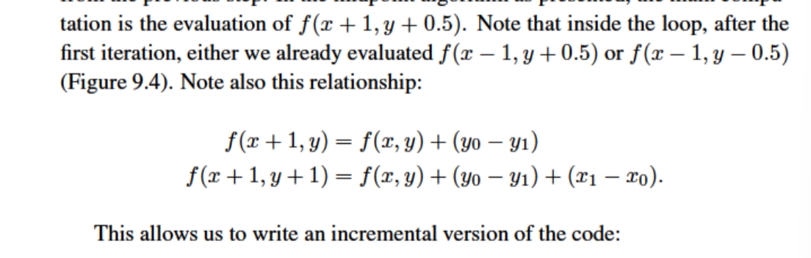
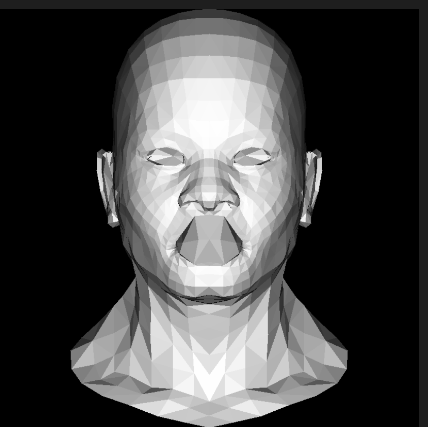
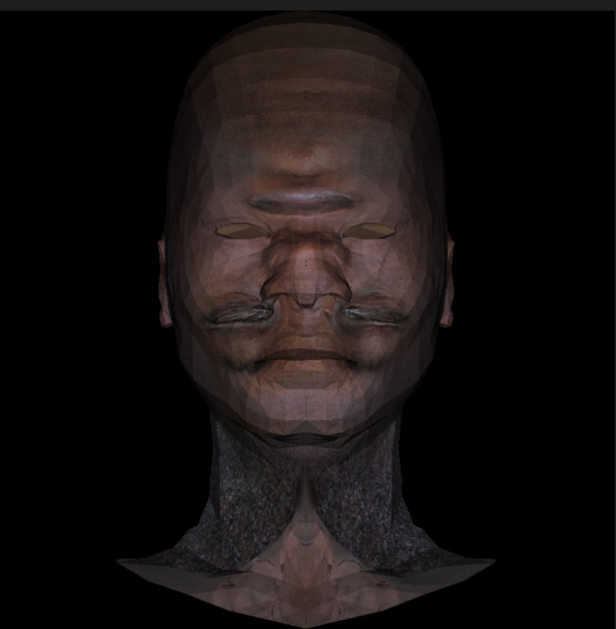
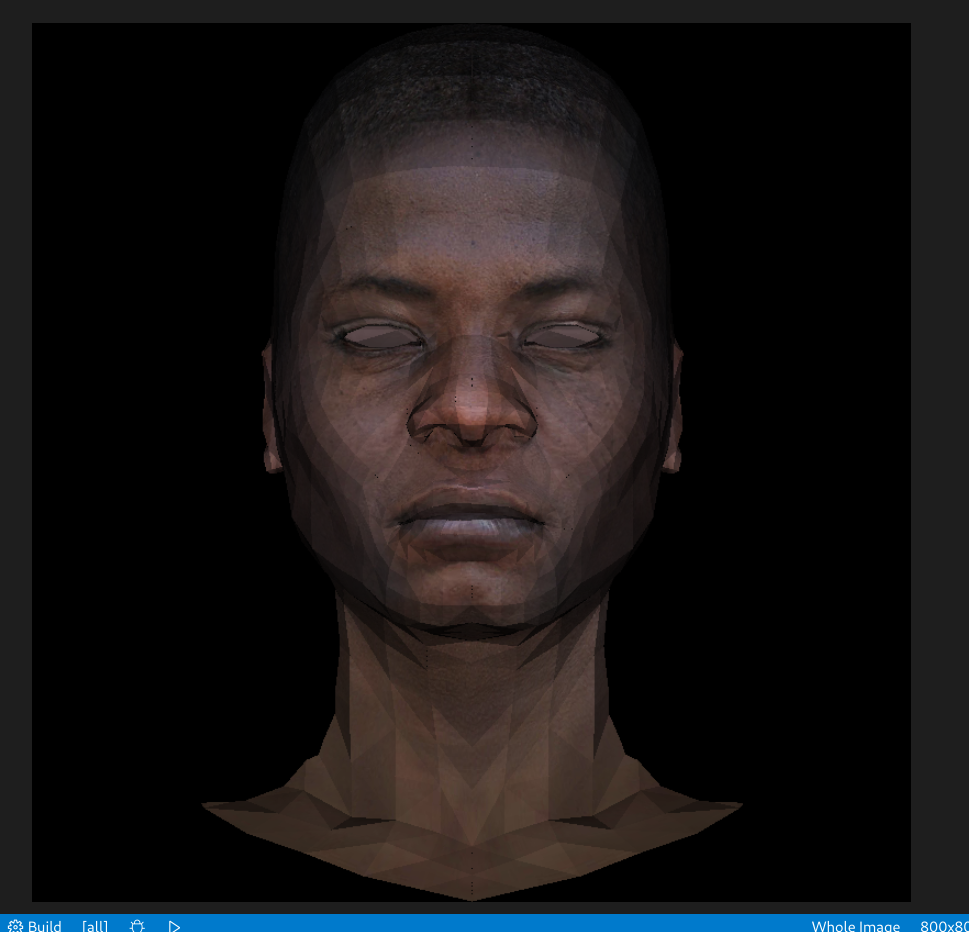
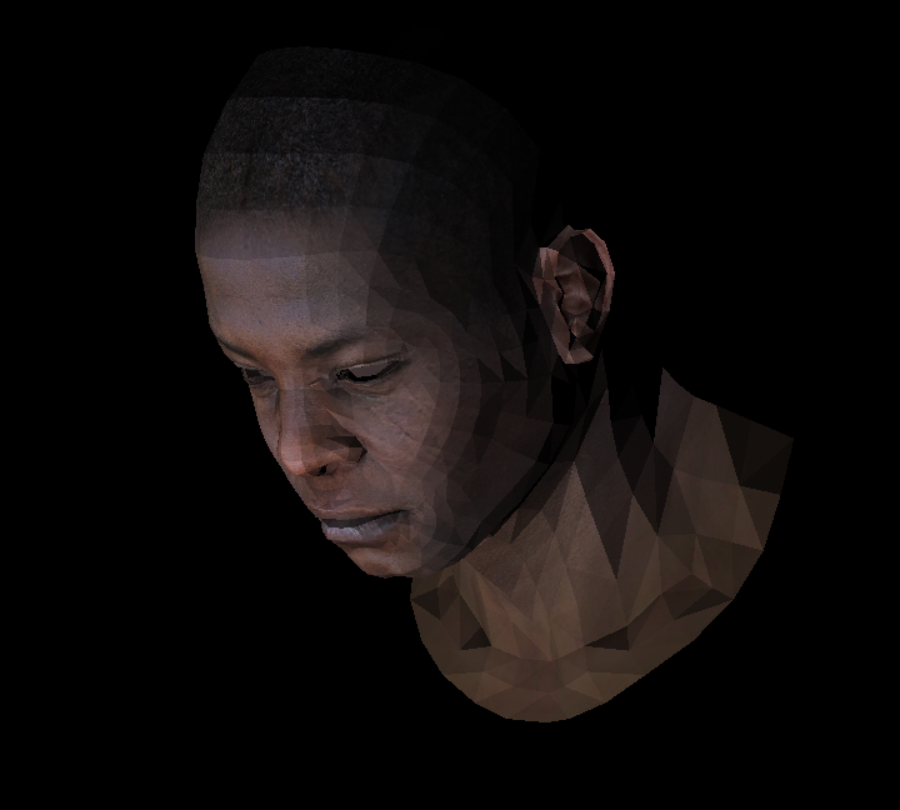
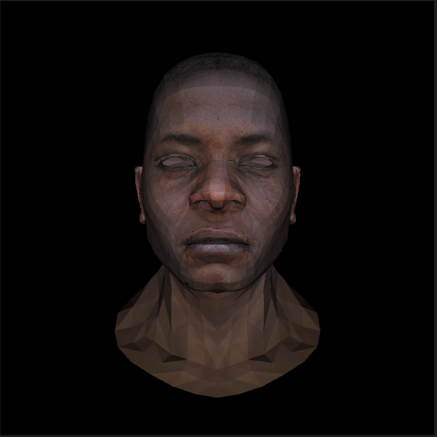
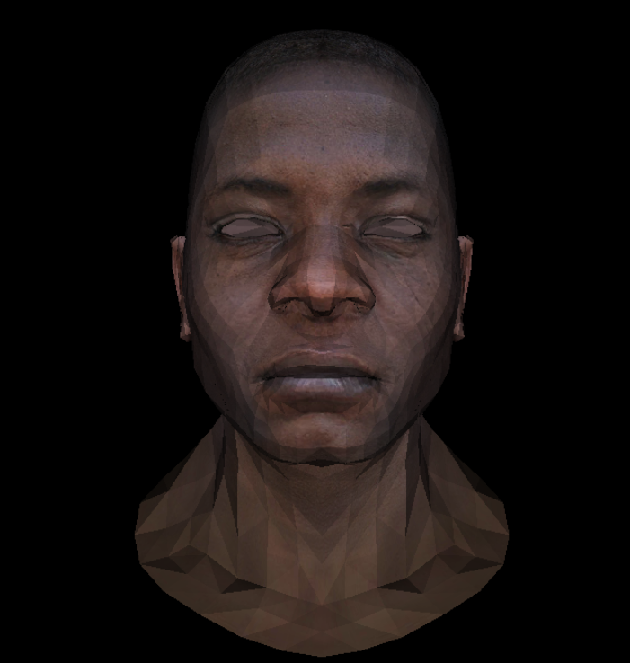
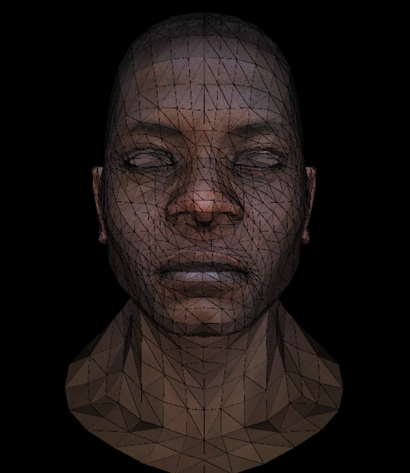

# myRender
# 软光栅
通过c++和Eigen库完成一个软光栅
参考了[这个](https://github.com/ssloy/tinyrenderer/wiki#tiny-renderer-or-how-opengl-works-software-rendering-in-500-lines-of-code)教程
- 使用Eigen库而不是教程中的头文件
- 使用了自己的model头文件来读取.obj文件
- 手写了变换矩阵
- 添加了MSAA

## 线
线使用的算法其实并不难

关键在于判断相对于当前像素下一个像素的走向，这里使用了虎书中提到都的算法：

在这一小节中这是最难的算法了

## 三角形
给出三个点的坐标画出这个三角形

这里采用的算法的思路也非常简单，求出三角形的包围盒，接着对包围盒中的点遍历，如果该点在三角形内就进行着色，如果该点不在三角形内则判断下一个点是否在三角形内

判断该点在不在三角形内有两种算法可以使用

### 向量法
关于这个方法，可以参考[这一篇文章](https://www.cnblogs.com/graphics/archive/2010/08/05/1793393.html)

这里要注意的是，为了让相邻的三角形中间没有缝隙，需要给判断条件加上等于

```cpp
bool InTriangle(Vec2i v0, Vec2i v1, Vec2i v2, int x, int y)//判断某个点是否在三角形内
{
    //以下是向量法，但是内容有瑕疵，详见笔记
    Vec2i temp(x, y);
    Vec2i x1 = v0 - v1;
    Vec2i x2 = v0 - temp;
    Vec2i x3 = v1 - v2;
    Vec2i x4 = v1 - temp;
    Vec2i x5 = v2 - v0;
    Vec2i x6 = v2 - temp;
    int a = crossProduct(x1.x,x1.y, x2.x,x2.y);
    int b = crossProduct(x3.x,x3.y,x4.x,x4.y);
    int c = crossProduct(x5.x,x5.y,x6.x,x6.y);
    if (a >= 0 && b >= 0 && c >= 0 || a < 0 && b < 0 && c < 0)
    {
        return true;
    }
    return false;
}
```
结果：



### 重心坐标法

这是games101中讲到的方法，同时后面的应用也非常的广泛，所以最后采用了这种方法

上面介绍向量法的文章中也提到了这个方法，可以看那一篇文章

结果同上

**不过这里要注意的是，重心坐标法的向量顺序不能随意写，重心坐标不对会导致渲染出的图形不是想要的图形。**


# zBuffer
zBuffer是一个很常用也很好用搞懂算法
原理也非常简单

教程使用的方法非常的精妙，把x，y，z三个维度的方程分开来解，再加上重心座标固有的性质，只需要两个方程就能解出三个重心座标

这也是后面使用zBuffer的一个条件，可以直接假设x，y之后不用管z，直接设这个点在平面上，接着通过重心座标解出z，这真的是非常棒的方法。

另，zBuffer记得采用double数组。


## 纹理&&Model
作者使用的geometry文件我使用了eigen库代替，我觉得eigen库更加好用。

接着写了model文件。

.obj文件中存储了模型的三角形，纹理坐标，法向量等一系列信息。

关于.obj文件，已经有很多人写了不错的文章来讲解，我就不再赘述。

这里需要强调的是，在加载纹理的时候，如果出现了以下这样的情况，（虽然有点让人掉san）



那就是在加载纹理的时候，忘记将纹理翻转了。
只需要将加载纹理的.tga文件翻转，就可以得到以下结果：


# 透视和坐标变换
这部分和虎书上说的整体来说相差并不大，认真的阅读虎书或者教程都能理解。

在我看来关键还是要理解不同的坐标系之间的关系，至于变换矩阵本身难度并不高。


在调整了透视矩阵的写法之后完成了透视投影的效果。
果然在double的矩阵中还是要写1.0/3.0而不是1/3，那样的话（指1/3）会被认为是0，导致实际上的透视投影矩阵是单位阵。
结果如下：


# shader
rasterization是object-order rendering的核心，rasterizer是任何一个图形渲染管线的重心。
对于每个被送进来的图元，rasterizer有两个职责：
- 枚举所有被图元覆盖的像素
- 插值
rasterizer的输出是fragment，每个fragment对应一个像素以及一些这个像素的性质

triangle函数是rasterizer
将所有的数据输入一个shader中，shader输出结果

重构了代码，将创建包围盒以及插值的任务交给了rasterizer函数，将计算颜色交给了fragment函数

第一次重构时出现了以下结果：


显然这种问题是两个相邻的三角形的相邻边的渲染问题

经检查是包围盒的创建时忽略了top和right的情况，修改之后得到以下结果：


# MSAA
将图片放大，我们能看到很明显的锯齿，这里采用MSAA的方法进行抗锯齿

MSAA使用以下公式来处理颜色：pixel_color = center_color * valid_points_num / sample_points_num

对于每一个像素，在该像素中取四个点，判定是否在三角形中，在三角想中的点的个数即为valid_points_num，而sample_points_num的个数则为固定的4.

使用该公式得到以下的结果：


---------------------------------------------------------------------------------------------------------------------------------------------------------
8.12 更新了shader的MSAA部分，但是只是让黑线的颜色变浅了，没有消除黑线

8.15 需要添加一个framebuffer来暂存颜色，方便MSAA在最后处理颜色，同时给MSAA包围盒加上了等号，但是效果不明显，只是让黑线没那么明显乐，并未消除黑线


